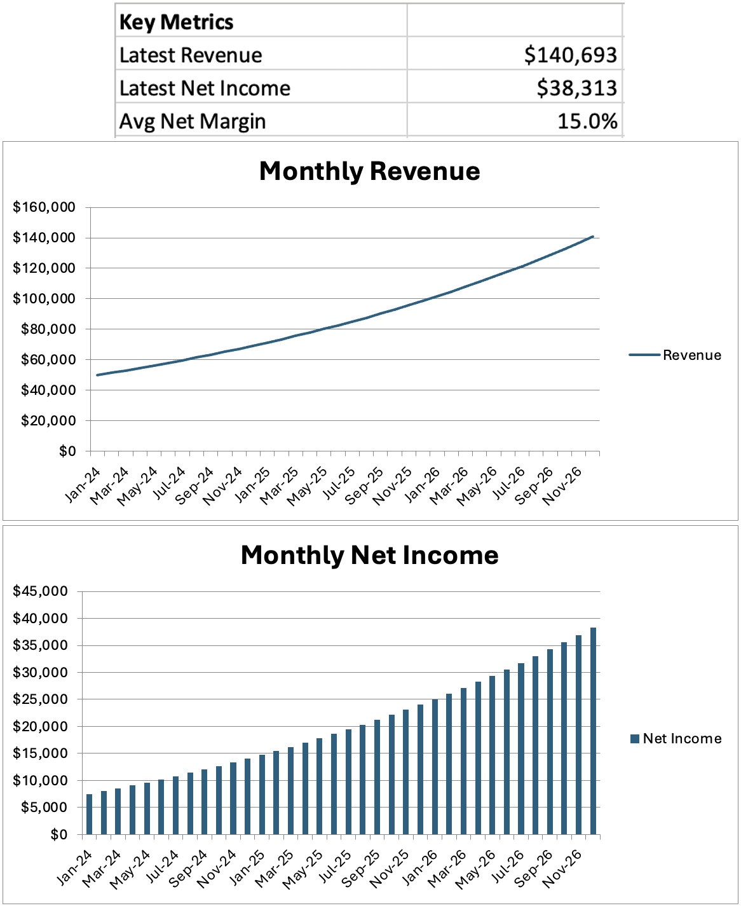
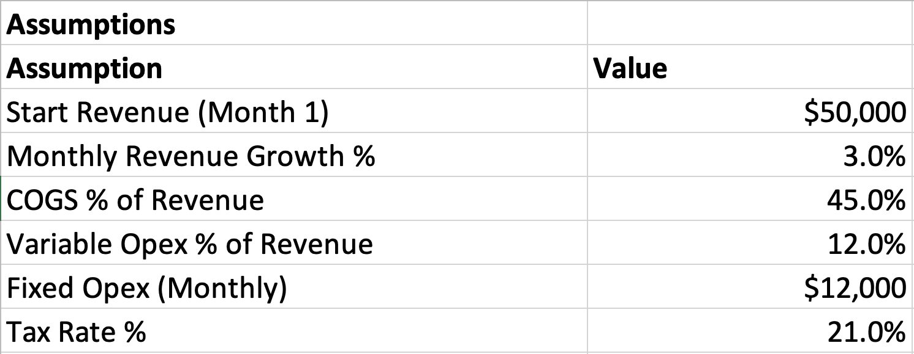
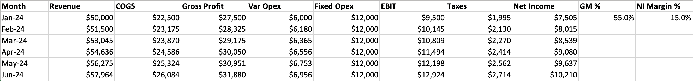

# Excel Financial Model & Dashboard (3-Year)

A simple 3-year monthly financial model built in **Excel** with a clean dashboard.  
The workbook includes **Assumptions**, a fully formula-driven **P&L**, and a **Dashboard** with KPIs and charts for quick business insights.

---

## Key Features
- Projects monthly **Revenue**, **COGS**, **Gross Profit**, **Operating Expenses**, **EBIT**, **Taxes**, and **Net Income**
- Assumption-driven: change **start revenue, monthly growth %, COGS %, variable opex %, fixed opex, tax rate**
- Auto-updated **Dashboard KPIs**:
  - Latest Revenue
  - Latest Net Income
  - Average Net Margin
- Visuals:
  - Monthly Revenue Trend (line chart)
  - Monthly Net Income (column chart)

---

## Sheets
- **Assumptions** – input drivers (highlighted cells for easy editing)
- **P&L** – 36-month, formula-driven profit & loss statement
- **Dashboard** – KPIs and linked charts

---

## Preview

### Dashboard

### Assumptions

### P&L Example

---

## How to Use
1. Open `Financial_Model_3yr.xlsx`
2. Go to the **Assumptions** sheet and edit inputs
3. Review the **P&L** sheet for calculated financials
4. Explore the **Dashboard** for KPIs and charts (auto-updates)

---

## Files
- `Financial_Model_3yr.xlsx` – full model
- `images/` – screenshots for documentation

---

## License
MIT (optional) – free to use and adapt
